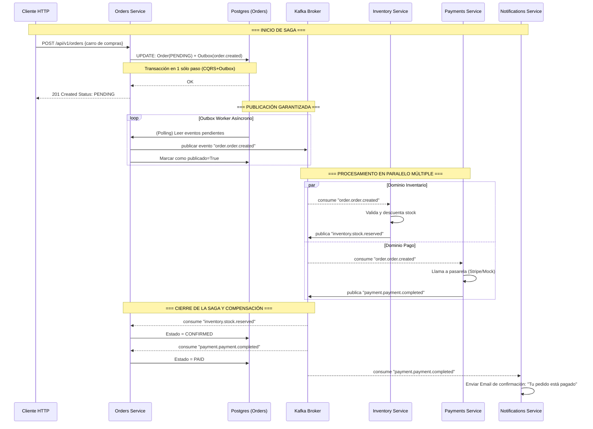

# Arquitectura Guiada por Eventos (EDA) - Exposición y Simulación

## 1. ¿Qué es EDA y Por qué usarla en nuestro E-commerce?
EDA (Event-Driven Architecture) es una arquitectura donde las piezas de software (Microservicios) se comunican emitiendo **Eventos**. Un "Evento" es simplemente "ALGO QUE YA OCURRIÓ EN EL PASADO" (ej. `Pedido Creado`, `Stock Reservado`, `Email Enviado`). 

A diferencia del paradigma REST donde el Servicio A llama al Servicio B y se **queda esperando la respuesta** (síncrono/bloqueante), en EDA el Servicio A lanza un evento a un "Buzón" (Kafka Broker) y sigue su vida. Cualquiera a quien le interese (Servicios B, C, o Z) lo toma cuando tiene capacidad, sin que el Servicio A se lo haya pedido (desacoplado/asíncrono).

### Ventajas en nuestra plataforma
1. **Resistencia a fallos**: Si el servicio de Emails ("Notifications") se cae, el sistema sigue vendiendo pedidos (`Orders` sigue funcionando). Cuando Notificaciones vuelve a levantarse, lee en el buzón los eventos que le faltaron procesar.
2. **Escalabilidad individual**: Si es "Hot Sale / Black Friday", el servidor de cobros (`Payments`) puede escalar a 10 instancias paralelas a consumir la avalancha de eventos.
3. **Agilidad entre Equipos**: Podemos crear mañanamente un nuevo equipo de análisis (Analytics). Sólo tiene que conectarse a Kafka y empezar a leer eventos sin tocar ni molestar a los desarrolladores y la base de código del servicio de Orders y Products.

---

## 2. Diagramas Visuales de la Arquitectura (Código Mermaid)

*Puedes incrustar estos scripts en tus diapositivas o plataformas como draw.io, mermaid.live y Notion.*

### A. Estructura Lógica Desacoplada
Este diagrama demuestra la regla arquitectónica de oro implementada: **Ningún servicio debe llamar a la Base de Datos de otro servicio ni llamar su API REST de forma interna.**

```mermaid
graph TD
    Client([Cliente HTTP / App]) -->|POST /api/v1/orders| Orders[Orders Service]
    
    subgraph "Dominio: Order (Core)"
        Orders -->|1. Guarda Order + Outbox\n(Transacción Atómica)| DB_Orders[(PostgreSQL\nOrders DB)]
        OutboxWorker[Outbox Worker] -->|2. Lee pendientes| DB_Orders
    end
    
    OutboxWorker -->|3. Publica 'order.order.created'| Kafka[[Apache Kafka\nEvent Bus]]
    
    subgraph "Dominio: Inventory"
        Kafka -->|4a. Consume| Inventory[Inventory Service]
        Inventory -->|Reserva stock| DB_Inv[(PostgreSQL\nInventory DB)]
        Inventory -->|5a. Publica 'inventory.stock.reserved'| Kafka
    end
    
    subgraph "Dominio: Payments"
        Kafka -->|4b. Consume| Payments[Payments Service]
        Payments -->|Procesa pago| DB_Pay[(PostgreSQL\nPayments DB)]
        Payments -->|5b. Publica 'payment.payment.completed'| Kafka
    end
    
    subgraph "Dominio: Notifications"
        Kafka -->|6. Consume\n'payment.payment.completed'| Notifications[Notifications Service]
        Notifications -->|Envía recibo| Mail((Servidor SMTP))
    end
    
    Kafka -->|7. Consume eventos\nde Inventario y Pago| Orders
    Orders -->|Actualiza Order a PAID| DB_Orders
```

### B. Secuencia del Flujo Asíncrono (Saga Coreográfica)
Demuestra el viaje secuencial (basado en reacción en cadena) para simular el caso de crear una orden.



---

## 3. Simulación de la Traza: Paso a Paso
Esto es lo que ocurre internamente de manera literal al disparar una petición. El flujo asíncrono simula la orquestación distribuida (la Saga).

1. 💻 **El Cliente Web manda POST a `8031/orders`** un carrito con 1 Laptop.
2. 🗄️ **Dominio Orders**: Se inserta un UUID y estado `"PENDING"`. Y en milisegundos y en la **misma Transacción SQL**, se inserta una traza de Kafka tipo *Outbox* indicando: `"Quiero divulgar que alguien quiere la orden XYZ"`. Respondemos rápidamente un _Status http `201 OK`_ a la App móvil para que el usuario no deba quedarse viendo ruedas de carga ("Spinners").
3. 📨 **El Worker Asíncrono de Pedidos**, un script puramente silencioso por detrás, se da cuenta que hay algo sin publicarse. Agarra el registro del *Outbox* y viaja a **Apache Kafka**. En el tópico `order.order.created` grita a los 4 vientos: "¡Se ha creado la orden XYZ por $149 USD!".
4. ⚙️ **La Magia Paralela (`Fan-Out`)**:
    - El **Inventario (`Inventory Service`)**: tiene sus orejas puestas en ese tópico (es su **Subscriber**). Recibe el aviso, consulta su Redis y descuenta la laptop. Luego vuelve a gritar a Kafka: `"inventory.stock.reserved"`.
    - Simultáneamente, el **Cobro (`Payment Service`)**: también es subscriptor del aviso universal `order.created`. Inicia el puente con la tarjeta de crédito (o Stripe). Si aprueba manda: `"payment.payment.completed"`.
5. 🛡️ **El Cierre Exitoso**: El Pedido (`Orders Service`), cuyo estado inicial era de **"PENDING"**, al consumir ambos eventos paralelos desde Kafka que informan que el stock fue bloqueado y el dinero entró, actualiza en su propia base SQL la orden de PENDING a `"PAID"`. 
6. 🔔 **Corolario Extra (`Notifications Service`)**: Él por último, lee `"payment.payment.completed"` y lanza el email transaccional usando servidor de correos (Aca, nuestro Mailhog). 

Todo ocurrió milisegundo a milisegundo entre redes distintas, tolerando latencias altas si `Stripe` estuviese sobrecargado, ya que el puente intermedio es asíncrono gracias a Apache Kafka.