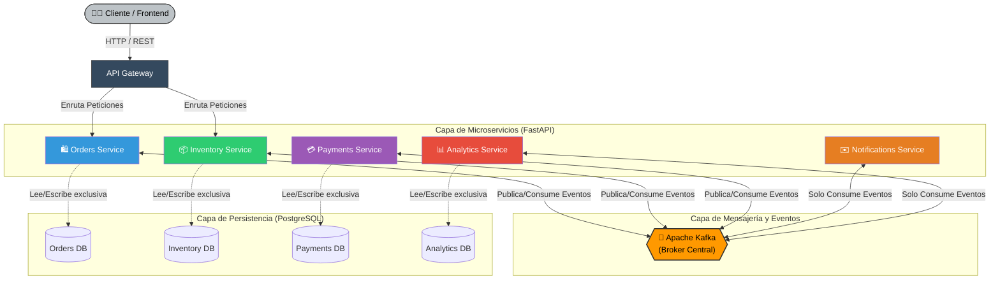

# Topología de la Arquitectura del Sistema (EDA)

Este diagrama representa la arquitectura general de alto nivel del sistema de comercio electrónico, destacando la separación de los microservicios, el API Gateway como punto de entrada, las bases de datos por servicio y el núcleo de eventos (Apache Kafka).

### Elementos Clave del Diagrama:
1. **API Gateway:** Único punto de entrada público que recibe las llamadas HTTP iniciales del frontend y las dirige hacia los microservicios pertinentes.
2. **Microservicios Independientes:** Desarrollados en FastAPI, se agrupan en su propia capa. Destacan servicios reactivos puros como `Notifications` y `Analytics`.
3. **Broker Central (Kafka):** El corazón de la comunicación asíncrona. Los servicios suben sus actualizaciones (eventos) y reaccionan a los publicados por los demás.
4. **Persistencia Aislada (Database per Service):** Ni el Gateway ni los servicios interfieren en las bases de datos ajenas, garantizando nulo acoplamiento estructural a nivel de base de datos.