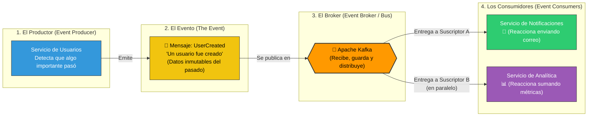

# Componentes Fundamentales de una Arquitectura Orientada a Eventos (EDA)

Este diagrama ilustra de manera general y conceptual las partes que componen un ecosistema EDA (Productor, Evento, Broker y Consumidor), demostrando cómo un mismo evento puede detonar múltiples reacciones sin que el creador original se entere.

### Explicación del Flujo Conceptual:
1. **El Productor** hace su tarea principal (registrar un usuario en su propia base de datos) y construye un paquete de datos.
2. **El Evento** es ese paquete. Lleva un nombre en pasado (`UserCreated`) porque representa un hecho consumado que no se puede cambiar.
3. **El Broker** recibe este evento, lo guarda en disco (para no perderlo jamás) y alerta a todos los interesados.
4. **Los Consumidores** escuchan este mensaje y hacen su trabajo de forma totalmente independiente: uno manda correos, otro actualiza gráficas, y el Productor original ni se entera de que existen.