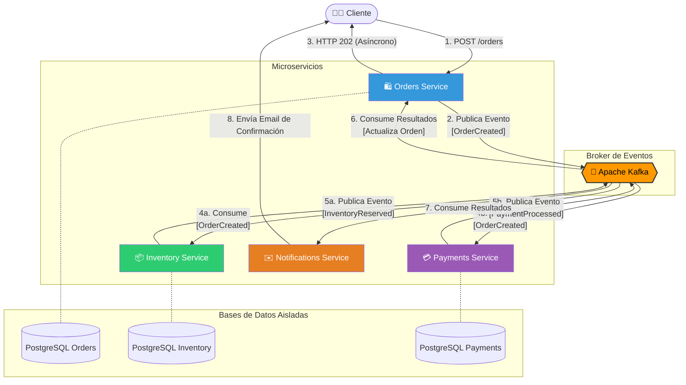
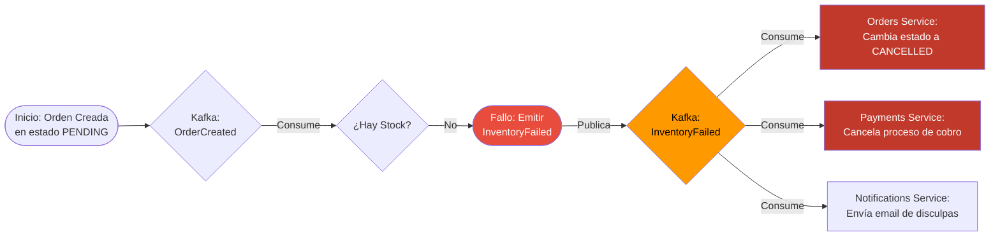

# Diagramas de Flujo: Topología y Datos

Estos diagramas de flujo representan la topología de red, la relación entre componentes y la dirección explícita de los eventos procesados en la arquitectura central.

## 1. Topología Principal del Ecosistema
Ilustra la separación entre los microservicios del ecosistema comercial, el uso central de Kafka y el principio de las bases de datos aisladas.

## 2. Árbol de Decisión Lógico (Fallo de Stock)
Visualización enfocada al comportamiento del flujo de decisión lógica cuando ocurre un fallo por reglas de negocio, y las consecuentes tareas de recuperación.

