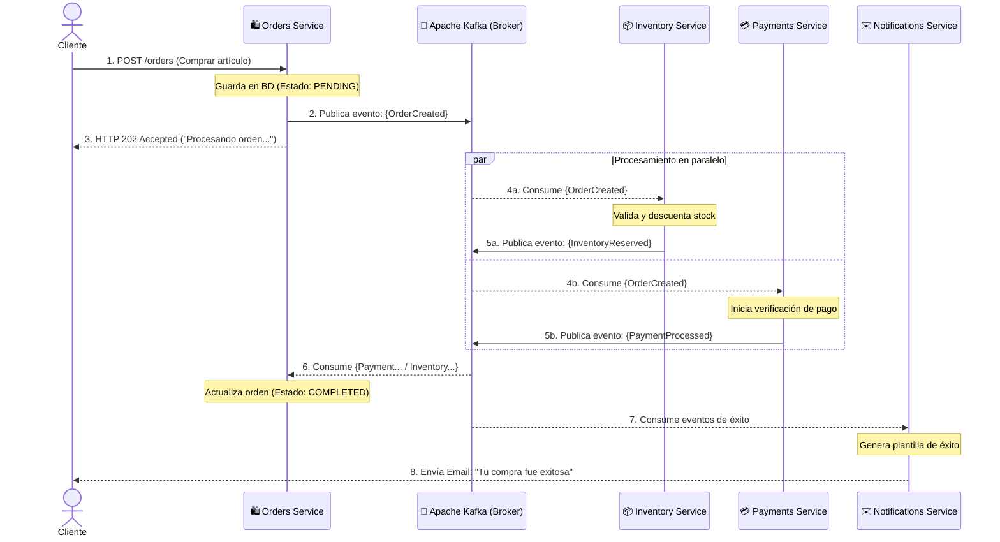
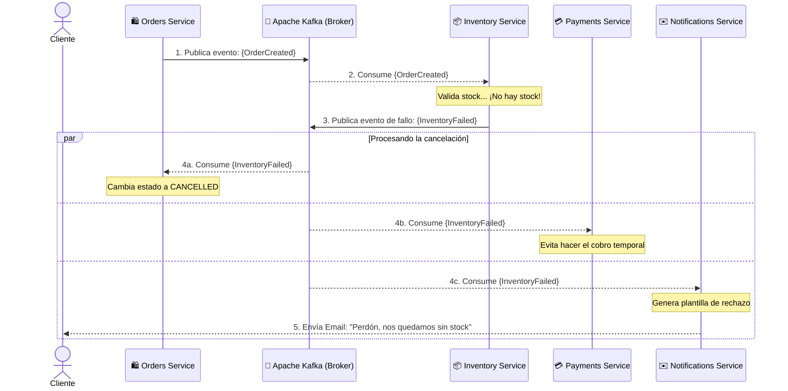

# Diagramas de Secuencia: Arquitectura Orientada a Eventos

Estos diagramas ilustran el comportamiento temporal y el intercambio de mensajes asíncronos entre los distintos microservicios a través del Event Broker.

## 1. Camino Feliz (Proceso Exitoso)
Muestra la respuesta asíncrona exitosa del ecosistema cuando se crea una orden y todos los servicios de dominio operan sin contratiempos.

## 2. Flujo de Compensación (Fallo de Inventario)
Muestra cómo reacciona el ecosistema para lidiar con problemas (ej. falta de stock de un artículo). Permite abortar transacciones distribuidas sin acoplar temporalmente los componentes.

